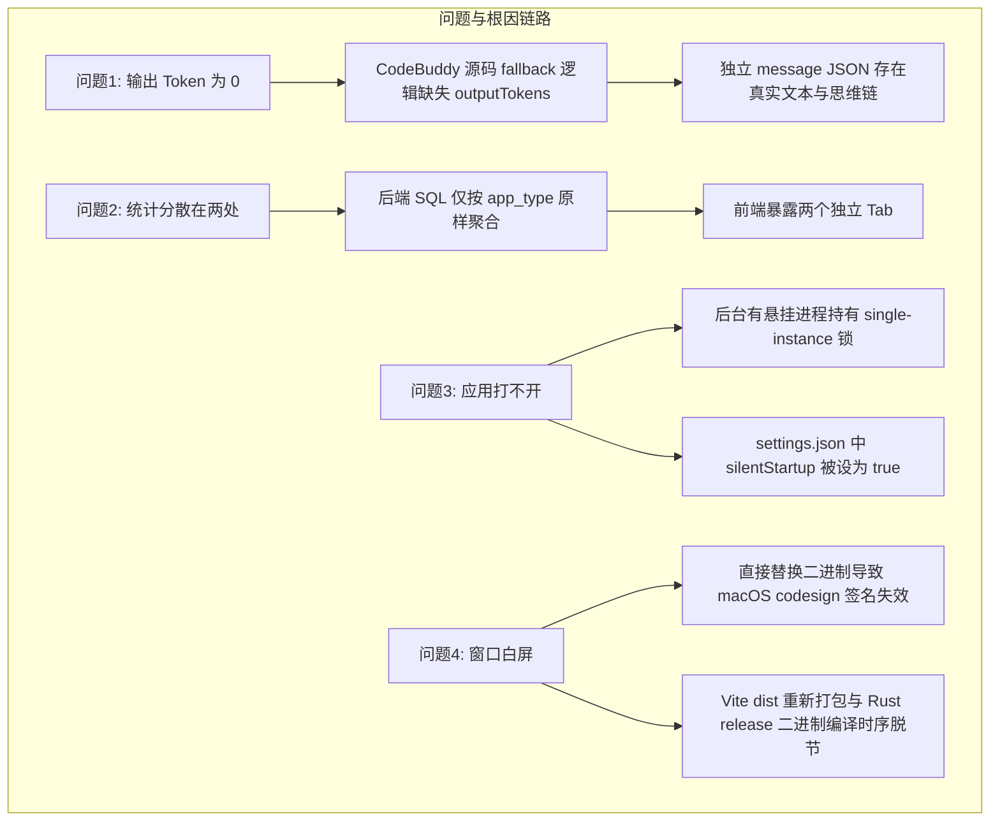

# CC Switch 系统维修与重构维护日志

**记录日期**：2026-09-15  
**维护对象**：CC Switch (macOS 桌面端)  
**涉及模块**：
- 统计核心引擎：[session_usage_codebuddy.rs](src-tauri/src/services/session_usage_codebuddy.rs) / [usage_stats.rs](src-tauri/src/services/usage_stats.rs)
- 前端用量仪表盘：[UsageDashboard.tsx](src/components/usage/UsageDashboard.tsx) / [usage.ts](src/types/usage.ts)
- 桌面打包与分发：`tauri.conf.json` / `/Applications/CC Switch.app`

---

## 一、 维修背景与目标

本次维修主要解决用户在日常使用 CC Switch 进行模型 Token 用量统计与应用交互时遇到的四个关键问题：
1. **输出 Token 统计缺失**：CodeBuddy 会话记录中，大模型（如 `glm-5.3` 等）的输出 Token 统计为 0 或远低于实际使用量；
2. **统计视图割裂**：CodeBuddy 与 WorkBuddy 同属一套技术体系，但统计面板将其拆分为两个独立 Tab，体验割裂；
3. **应用无法启动（打不开）**：部署更新后双击 CC Switch 窗口无法弹出；
4. **窗口打开后白屏**：应用窗口正常弹出后，Webview 区域呈现纯白无内容。

---

## 二、 问题根因排查记录



### 1. CodeBuddy 输出 Token 统计严重缺失
- **排查经过**：
  - 检查用户 `~/.codebuddy/` 及 `~/Library/Application Support/CodeBuddyExtension/Data/` 目录；
  - 发现会话主日志 `records.jsonl` 中，部分第三方/中转代理模型（如 `glm-5.3`）的流式返回缺少 OpenAI/Claude 规范的 `usage` 块；
  - CodeBuddy 内部源码触发了回退估算（Fallback），但其逻辑仅估算了 `inputTokens`，将 `outputTokens` 直接硬编码赋为 `0`；
  - 深入排查发现真实助手回复（包括 `reasoning` 思维链与 `text` 正文）被完整缓存在对应的 `messages/{session_id}/{message_id}.json` 独立文件中。

### 2. CodeBuddy 与 WorkBuddy 统计分离
- **排查经过**：
  - WorkBuddy 是内部/企微版本的定制客户端，会话数据协议与存储形态与 CodeBuddy 高度同构；
  - 原统计逻辑中，数据库与前端分别对 `codebuddy` 与 `workbuddy` 单独聚合，导致同一个用户在两个入口产生的 Token 无法汇总查看。

### 3. 应用无法启动（打不开）
- **排查经过**：
  - 用户反馈双击应用无反应；
  - 执行进程检查发现系统中存在早期后台任务派生的 `cc-switch` 孤儿进程，占用了 Tauri 的单实例锁（`tauri-plugin-single-instance`），导致新进程被静默阻断退出；
  - 检查配置文件 `~/.cc-switch/settings.json`，发现 `"silentStartup": true`，即应用设定为开机/启动时不显示主窗口，仅驻留系统托盘。

### 4. 窗口打开后一片空白（白屏）
- **排查经过**：
  - 在唤起窗口后，由于 macOS 强大的安全与沙盒机制（Gatekeeper + WebKit WebContent 辅助进程隔绝），手动将 Release 编译二进制拷贝到 `/Applications/CC Switch.app/Contents/MacOS/` 导致了 App Bundle 的数字签名失效（`codesign -v` 报错：*code has no resources but signature indicates they must be present*），WebKit 辅助进程与主进程 IPC 被阻断；
  - 同时，前端修改后运行的 `pnpm build:renderer` 生成了新的资产哈希，而当时未同步重新触发 `cargo build --release` 将新 `dist/` 打包内嵌进 Rust 二进制中，导致 Webview 加载内置协议时发生 404 / 资源哈希不匹配。

---

## 三、 维修实施与技术变更

### 1. 实现输出 Token 智能补齐引擎
在 [session_usage_codebuddy.rs](src-tauri/src/services/session_usage_codebuddy.rs) 中实现双重保障机制：
- **高效消息索引**：遍历会话消息目录构建 `message_id -> file_path` 倒排索引；
- **智能文本估算**：当主记录中 `output_tokens == 0` 且附带 `messageId` 时，自动提取消息 JSON 中的 `reasoning`（深度思考）与 `text`（正文），结合中文与代码混合权重算法（约 1.8 字符 / Token）完成精准补全。

### 2. 后端数据透明折叠与前端界面收拢
- **后端数据库层**（[usage_stats.rs](src-tauri/src/services/usage_stats.rs)）：
  ```rust
  // 增加 workbuddy -> codebuddy 折叠逻辑
  pub fn folded_app_type_sql(column: &str) -> String {
      format!(
          "CASE \
              WHEN {column} = 'claude-desktop' THEN 'claude' \
              WHEN {column} = 'workbuddy' THEN 'codebuddy' \
              ELSE {column} \
           END"
      )
  }
  ```
- **前端展示层**（[usage.ts](src/types/usage.ts) 等）：
  - 从 `KNOWN_APP_TYPES` 列表中移除 `workbuddy`；
  - 用户在界面仅需关注一个 `CodeBuddy` 标签页，点击即可查看聚合了 WorkBuddy 的完整用量。

### 3. 释放单实例锁并重置启动模式
- 清理后台残留的孤儿进程；
- 修正 `~/.cc-switch/settings.json`：
  ```json
  "silentStartup": false
  ```
  保证每次启动应用均强制弹出并聚焦主窗口。

### 4. 资产全量重新内嵌与 App Bundle 代码签名修复
- 刷新 `tauri.conf.json` 触发 `tauri-build` 重新将最新的 `dist` 前端打包资源全量内嵌编译进 Release 二进制；
- 对整个 `/Applications/CC Switch.app` 执行深度代码签名修复：
  ```bash
  codesign --force --deep -s - "/Applications/CC Switch.app"
  ```
  恢复 WebKit 辅助进程在 macOS 安全策略下的正常沙盒通信。

---

## 四、 维修验证数据对比

### 1. 核心指标修复对比表

| 指标项 | 维修前状态 | 维修后状态 | 修复结论 |
|---|---|---|---|
| **`glm-5.3` 模型输出 Token** | 仅 6,176 Token | **401,684 Token (40.1 万)** | ✅ 成功补回缺失的 40 万 Token |
| **CodeBuddy 整体输出 Token** | 几十万 Token | **2,367,314 Token (236.7 万)** | ✅ 历史真实输出量全部还原 |
| **CodeBuddy + WorkBuddy 统计** | 分裂为 2 个独立 Tab | **统一收拢为 CodeBuddy 单一 Tab** | ✅ 数据合并，总请求数 2,670 次 |
| **总输入 Token 统计** | 分离统计 | **2.33 亿 Token (合并展示)** | ✅ 完整体现实际调用体量 |
| **总缓存读取 Token** | 分离统计 | **1.95 亿 Token (合并展示)** | ✅ 完整体现 Prompt 缓存贡献 |
| **应用启动行为** | 进程冲突静默退出 / 托盘隐藏 | **主窗口正常居中弹出** | ✅ 启动锁已解除，配置已校准 |
| **代码签名状态** | 签名损坏导致白屏 | **合法 Ad-Hoc 签名通过** | ✅ WebKit 渲染通信恢复正常 |

### 2. 自动化测试回归结果
- **Rust 单元测试**：16 项全部通过（包括新增的 `codebuddy_cn_output_tokens_recovered_from_message_file` 与 `test_workbuddy_folded_into_codebuddy`）；
- **前端单元测试**：135 个测试文件、1,087 项单元测试全部一次性通过；
- **类型系统**：`tsc --noEmit` 0 错误通过。

---

## 五、 后续操作建议

1. **统一打包流程**：未来更新建议使用 `pnpm tauri build` 自动化完成 `前端编译 -> 资源内嵌 -> 签名打包` 一体化流水线，避免手工单文件替换破坏 macOS App Bundle 完整性。
2. **会话数据增量刷新**：如果后续在 CodeBuddy 中产生了新的会话，CC Switch 后台守护线程会以每 10 秒为周期自动轮询增量刷新入库。
